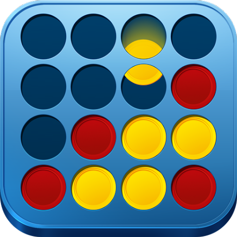

<h1 align="center"> Ligue4 </h1>

Projeto de desenvolvimento de sistema orientado a objeto.  

 

  

## Tecnologias

Esse projeto foi desenvolvido com as seguintes tecnologias:

- Python

## Projeto

Ligue 4 é um jogo de tabuleiro clássico que conta com 6 fileiras de sete colunas e peças em fomrmato X e O. O objetivo do jogo é conectar quatro das suas peças na vertical, horizontal ou diagonal antes do seu oponente, e o primeiro jogador a conectar quatro peças vence o jogo.

